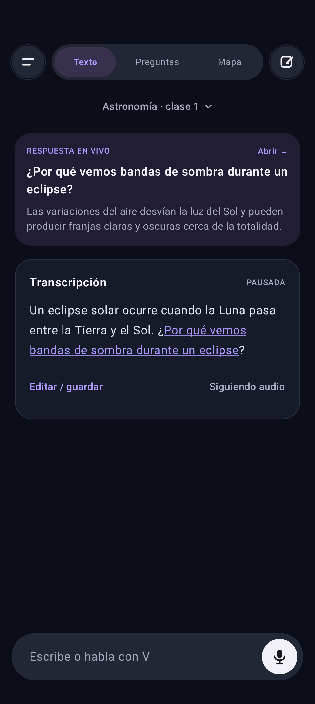
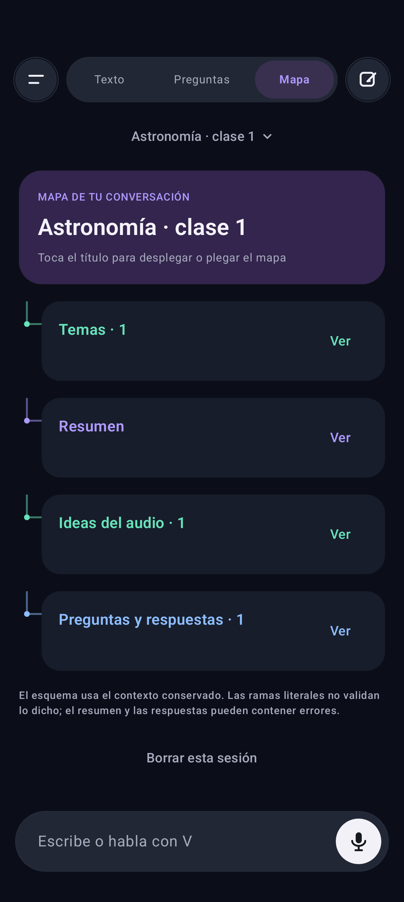

# V · Local Voice Assistant Android


Asistente nativo en Kotlin y Jetpack Compose: transcripción local, preguntas en vivo, historial privado y mapas de conversación.

## Interfaz actual · 0.17

Texto, Preguntas y Mapa fijos arriba. Menú lateral de historial, nuevas conversaciones y escritura con micrófono en la misma pantalla. Conserva el fondo oscuro y los acentos violeta y verde de V.

Las capturas siguientes usan contenido ficticio.





## Android 0.17: conversación más despejada

Texto, Preguntas y Mapa se muestran en un selector redondeado fijo en la cabecera, con acceso al historial a la izquierda y a una nueva conversación a la derecha. El título del chat se puede tocar para renombrarlo. Se retiraron las barras repetidas dentro del contenido y se redujo el espacio inferior sobrante. La barra de escritura mantiene el teclado y el micrófono en el mismo chat, con un contorno más discreto y un icono de envío. Se conserva la paleta existente: fondo oscuro, acento violeta y verde durante la escucha.

La revisión visual usa conversaciones ficticias; no publica el historial del usuario. Compilación, capturas de Texto/Preguntas/Mapa y adaptación horizontal revisadas. La prueba del compositor pasó. La prueba de teclado comprueba solicitudes de apertura y foco, no la visibilidad de un teclado real.

## Android 0.16.1: foco y teclado de escritura

El campo solicita el teclado después de recibir el foco y también al volver a tocarlo cuando ya estaba enfocado. Conserva el borrador al cerrar el teclado; enviar o usar el micrófono libera el foco y solicita cerrar el teclado. La cabecera permanece visible para evitar cambios de altura al escribir. La ventana usa ajuste de tamaño para el teclado.

La prueba instrumentada del compositor pasó: verifica solicitudes de apertura repetidas, conservación del borrador, envío y cambio a voz con un controlador de teclado de prueba. No verifica que un teclado real se muestre: la comprobación de visibilidad del IME del emulador no pasó, incluso habilitando temporalmente el teclado en pantalla. La configuración del emulador fue restaurada; la apertura visual en el teléfono sigue pendiente.

## Android 0.16: escribir en el mismo chat

La barra «Escribe o habla con V» ahora es un campo de texto editable dentro de la conversación. Permanece visible sobre el teclado, permite enviar con la flecha o la acción Enviar del teclado y mantiene el micrófono al lado. Se retiró la hoja modal de escritura. Al enviar, la respuesta seleccionada corresponde a la consulta escrita y aparece en la vista Texto del mismo chat. El borrador se asocia a la conversación actual. Compilación verificada; la interacción visual con el teclado requiere revisión en el dispositivo.

## Android 0.15.3: detectar interrupciones de transcripción

Android local vigila el avance de la captura y del canal PCM. Detecta 12 segundos sin avance de audio y 45 segundos sin texto con al menos 8 segundos acumulados de audio sobre un umbral RMS (0,003). Ese umbral indica actividad acústica, no voz certificada: música o ruido sostenido pueden provocar una recuperación. El silencio sin actividad no dispara la regla de ausencia de texto. El nivel del micrófono ahora se refleja en la interfaz.

Ante un bloqueo o una terminación recuperable del servicio, cierra ordenadamente y reconecta hasta tres veces por activación manual, con esperas crecientes. Muestra el estado de reconexión y detiene la escucha si no consigue recuperarla; no deja el indicador activo indefinidamente. Detener manualmente, cambiar de chat o salir cancela la reconexión. Los reinicios excepcionales pueden perder audio durante el cierre y la espera; esta versión no garantiza captura sin huecos. No cambia el volumen del teléfono ni usa un motor conectado.

Investigación: antes del cambio, una prueba con PCM español sintético completó 25 ciclos en 151 segundos sin detenerse. No reprodujo el fallo del micrófono real ni estableció un límite de tiempo del servicio. La protección añadida no es una confirmación de la causa específica del usuario. Las reglas de detección se verifican con pruebas unitarias y el ViewModel se prueba para comprobar que Detener cancela una reconexión pendiente.

## Android 0.15.2: cambiar de chat durante la escucha

Crear o abrir una conversación detiene la sesión activa, conserva el último texto disponible y guarda el chat anterior. El cambio espera al cierre del servicio y de la captura antes de mostrar la nueva conversación. Mientras se cierra, no permite otro inicio de escucha; las respuestas tardías no se incorporan al chat nuevo. El micrófono queda pausado y puede iniciarse de nuevo en el chat seleccionado.

Compilación y 19 pruebas unitarias pasaron. La prueba instrumentada `ConversationSwitchListeningTest` usa el ViewModel real y reconocimiento local con audio PCM sintético: inicia/transcribe, crea un chat sin detener manualmente, vuelve a escuchar y comprueba que el segundo texto llega sin fragmentos del primero. No valida el micrófono físico ni la precisión de audio con ruido.

## Android 0.15.1: cierre antes de volver a escuchar

El siguiente inicio de Android local espera a que termine la captura anterior. Se cierra la entrada de audio, se despacha cancelación al servicio antes de destruirlo y se libera AudioRecord cuando termina su hilo de lectura. Los avisos de sesiones anteriores no cambian el estado de una sesión nueva. No se añaden reintentos automáticos por frase.

La prueba de reconexión realiza tres ciclos consecutivos de inicio/transcripción/detención con audio PCM sintético inyectado. La prueba del micrófono del emulador con voz real sigue dependiendo de su entrada CoreAudio y requiere comprobación manual.

## Android 0.15: reconocimiento local continuo

Android local ahora usa una única sesión segmentada con PCM mono de 16 kHz mediante `EXTRA_AUDIO_SOURCE`. El micrófono se abre una vez y se mantiene mientras se escucha; los resultados de segmentos reciben IDs distintos y alimentan el historial y las preguntas existentes. Se retiraron los reinicios automáticos tras cada frase, silencio o error. Al detener la escucha se conserva el último texto parcial y se liberan captura, pipe y servicio.

Requiere Android 13+ y que el servicio instalado admita entrada PCM y sesiones segmentadas. Si devuelve una sesión convencional o termina inesperadamente, la app muestra un mensaje y no entra en un ciclo de pitidos/reintentos. Android 12 puede seguir usando Moonshine o Soniqo. No se silencian ajustes de audio del teléfono ni se activa un servicio en la nube.

Validación: compilación y 19 pruebas unitarias pasaron. Una prueba instrumentada alimentó dos frases sintéticas españolas, separadas por silencios, al servicio local del emulador y comprobó ambos resultados, IDs de segmento diferentes y exactamente una llamada de inicio sin terminación anticipada. Esta prueba valida la sesión con audio inyectado; no certifica ausencia de sonidos del proveedor ni funcionamiento del micrófono físico. El paquete `es-ES` fue descargado mediante la API pública y aparece instalado. La calidad en videos con ruido y la comparación con Google conectado siguen pendientes.

Referencia: [sesiones segmentadas y fuente de audio](https://developer.android.com/reference/android/speech/RecognizerIntent#EXTRA_AUDIO_SOURCE).

## Android 0.14: Soniqo con Parakeet multilingüe

Se añadió el SDK `audio.soniqo:speech:0.0.22`, captura por micrófono y audio directo del video, importación local de modelos y conexión al historial/preguntas existentes. La configuración usa CPU sin optimización específica para el A54. El APK sigue limitado a Android 12+ ARM64; esto no garantiza compatibilidad o rendimiento en todos los teléfonos.

La compilación y 19 pruebas unitarias pasaron. En un emulador ARM64 pasaron cinco pruebas: importación y selección del motor, transcripción progresiva española con Soniqo, Moonshine, generación local de respuestas y ausencia de permiso de Internet. La prueba española usa un WAV sintético y comprueba una pregunta sobre el círculo; no es una evaluación amplia de precisión ni una prueba de ruido físico. No se ha demostrado aún una mejora de precisión, latencia o consumo frente al motor anterior o Google.

En Ajustes, importa `soniqo-es-streaming.zip`: la importación selecciona Soniqo. El paquete multilingüe ocupa aproximadamente 1,03 GiB y se guarda en archivos privados de la app. El APK contiene el SDK, pero los modelos se importan aparte. Moonshine permanece disponible para comparar. Ambos runtimes ONNX se empaquetan con nombres diferentes: una tarea de compilación cambia las referencias ELF del SDK Soniqo sin alterar sus clases ni los modelos. Esto evita el conflicto de símbolos observado durante las pruebas.

El preparador `tools/prepare_soniqo_models.py` genera el ZIP para TDT con manifiesto de revisiones y hashes. No usar el ZIP EOU de la primera prueba con esta configuración. El SDK exige recursos Kokoro al crear la pipeline aunque V no los use para hablar. DeepFilterNet3 no se activa en la pipeline de esta versión del SDK; no se promete eliminación neural de música o ruido. La app no añade permiso de Internet ni descarga modelos durante la escucha.

Fuentes: [SDK Android](https://github.com/soniqo/speech-android), [modelo TDT](https://huggingface.co/soniqo/Parakeet-TDT-v3-ONNX). Soniqo no es el motor privado de Google Transcripción instantánea.

## Android 0.13: reconocimiento local del sistema (experimental)

Ajustes → Reconocimiento de voz permite elegir Moonshine o Android local. La segunda opción llama exclusivamente a `SpeechRecognizer.createOnDeviceSpeechRecognizer`; no usa el reconocimiento conectado ni cambia de motor automáticamente. Requiere un servicio local compatible y español instalado en el teléfono. No incorpora ni replica el modelo privado de Google Live Transcribe. La captura directa del video conserva Moonshine.

«Priorizar solo transcripción» evita generar respuestas y resúmenes durante la escucha y descarga el LLM al iniciar una captura nueva. El resumen final puede generarse al pausar. Los textos e historial permanecen. Activa este modo antes de escuchar para comparar voz sola frente al asistente completo.

El reconocimiento Android funciona por sesiones: reinicia tras resultados o silencios, con un pequeño intervalo, que puede perder palabras entre sesiones. No se promete captura ininterrumpida de una clase. Si el servicio o el idioma no están disponibles, aparece un error; selecciona Moonshine manualmente. Calidad, consumo y precisión de este modo aún requieren una prueba en el A54, primero en modo avión, con la misma grabación para ambos motores. No se ha demostrado igualdad de eficiencia con Transcripción instantánea.

Referencia: [API oficial SpeechRecognizer](https://developer.android.com/reference/android/speech/SpeechRecognizer).

## Android 0.12: sidebar rediseñado

Menú lateral con filas compactas, iconos vectoriales, búsqueda sin borde, botón destacado para nueva conversación y selección del chat activo. El historial se agrupa en Hoy, Ayer, Últimos 7 días y Anteriores según la fecha de actualización del dispositivo. Lista virtualizada para historiales largos. Textos guardados y Ajustes están en un bloque inferior.

## Android 0.11: menú lateral y barra de voz

El botón ☰ abre un menú lateral con el historial, buscador y «Nueva conversación». Toca un chat para abrirlo y continuar con el micrófono. Textos guardados y Ajustes se encuentran también en el menú. La barra inferior compacta permite escribir y contiene el micrófono; durante la escucha muestra el nivel real de audio y permite pausar. Se retira la navegación inferior y el gran micrófono flotante.

## Android 0.10: chats y mapa interactivo

Toca una tarjeta del historial para abrirla en Mapa. Desde el chat, «‹ Chats» regresa al historial y «＋» inicia otro. Toca el nombre en la barra del chat para nombrar tu materia; el nombre se conserva al continuar otras clases. Pulsa el micrófono en un chat reabierto para añadir la nueva transcripción sin borrar lo anterior.

En Mapa, el título pliega o despliega el esquema. Toca el encabezado de una rama para abrirla con animación. «Temas» agrupa todos los fragmentos por palabras destacadas y permite revisarlos; es una clasificación léxica, no una identificación semántica garantizada. El resumen sigue usando contexto reciente.

## Android 0.9: conversaciones organizadas

El historial conserva la transcripción, preguntas, respuestas y resumen de cada conversación. Al abrir una entrada se muestra su mapa, reconstruido del texto guardado. Las tarjetas incluyen tema, fecha y contadores. Se elimina el encabezado «Tu conversación». Las nuevas sesiones ya no recortan el historial a 80 fragmentos o 30 respuestas; el contexto enviado al modelo sigue limitado para no saturarlo. El resumen no representa necesariamente toda una sesión larga. Los fragmentos descartados por versiones anteriores no pueden recuperarse.

# V · Asistente Android independiente

Versión 0.17: app nativa Kotlin + Jetpack Compose para Android ARM64. El Galaxy A54 de 8 GB se utilizó en el laboratorio de rendimiento. Escucha, transcripción progresiva, preguntas relevantes, respuestas locales, resumen reciente y textos seleccionados persistentes. Funciona sin servidor Mac y sin servicios remotos de transcripción. El laboratorio de rendimiento sigue disponible en Ajustes.

## Interfaz y uso

- Campo de escritura y micrófono circular en la barra inferior del chat. Toca el micrófono para iniciar y vuelve a tocar para pausar. El indicador muestra RMS medido del audio del micrófono, no una animación de audio simulado.
- Diseño oscuro con acentos violetas; la escucha usa un indicador verde. Texto, Preguntas y Mapa en la cabecera; historial, textos guardados y Ajustes en el menú lateral.
- Texto plano continuo por defecto. «Editar o guardar fragmentos» permite corregir texto, asignar una etiqueta manual y guardar una selección. Activar «Etiquetar voces» muestra los bloques; no añade clasificaciones de pregunta/afirmación al texto.
- Respuestas progresivas junto a la transcripción en ventanas de al menos 600 dp; en vertical aparece primero la respuesta más reciente para conservar legibilidad. Explicaciones de conocimiento general, sin verificación externa.
- Detección por señales lingüísticas conservadoras: requiere una pregunta con contenido, descarta fragmentos incoherentes conocidos y no responde a cualquier «que». No es una evaluación semántica infalible ni una reparación del audio.
- Resumen de contexto reciente: solicita una actualización cada 20 segundos cuando la generación está libre, o al pulsar Actualizar resumen. Usa las últimas ocho intervenciones hasta 1.200 caracteres; no se presenta como resumen exhaustivo de una sesión larga. Los fragmentos relevantes son citas literales seleccionadas por reglas de longitud y palabras clave.
- Guardado explícito de datos estructurados: recuerdos, tareas, cursos y proyectos con IDs estables, edición y borrado. Las tareas permiten curso/proyecto, fecha escrita por el usuario y completar/reabrir. No se inventan fechas, responsables ni obligaciones a partir del audio. La procedencia distingue texto escrito, transcripción, resumen y respuesta del modelo.
- El mensaje escrito «qué tengo pendiente de Cálculo» consulta los textos seleccionados localmente. Las preguntas del audio nunca reciben esos datos ni ejecutan acciones de guardado.
- «Escuchar» usa una voz española del sistema que no requiera conexión; si no está instalada, indica cómo habilitarla. Pausa el micrófono para evitar transcribir su propia salida. No hay lectura automática.

## Actualizar desde el laboratorio

Instala el nuevo APK **encima de la app anterior**, sin desinstalarla. Conserva el identificador `com.heyler.voicelab` y la firma de desarrollo usada en esta máquina, por lo que mantiene los modelos ya importados. No incluye los pesos dentro del APK. La distribución actual es un APK de desarrollo; una publicación en Play Store requiere su propia firma y preparación de distribución.

## Concurrencia y contexto

ASR y generación se ejecutan en trabajos separados. Solo una generación local trabaja a la vez; la cola admite ocho solicitudes pendientes y muestra cuando una pregunta se omite por saturación. Las hipótesis se revisan sobre el mismo fragmento, con espera de 1.500 ms para parciales y 500 ms para finales. Cambios de la pregunta invalidan la respuesta derivada; cambios de narración que conservan la pregunta no la repiten. No se reinicia el motor cada frase.

El historial privado conserva los fragmentos y respuestas de cada conversación sin el recorte de las versiones antiguas. El contexto enviado al modelo sigue limitado. Borrar sesión elimina ese contexto y su entrada de historial sin borrar textos elegidos. Al enviar la app al segundo plano se detienen escucha y generación; la rotación conserva la sesión y la captura; los modelos pueden seguir residentes mientras exista el proceso. La base SQLite de textos elegidos usa almacenamiento privado de la app, copias de seguridad deshabilitadas y borrado directo, sin embeddings ni índices externos. No se afirma cifrado propio adicional al almacenamiento del dispositivo ni autenticación biométrica.

## Alcance actual

Las etiquetas de voz son manuales. No incluye huellas de voz, diarización automática, Telegram, notificaciones de tareas, extracción automática de fechas relativas ni verificación en Internet. La versión 0.6 añade captura directa de audio de reproducción mediante consentimiento de Android. No promete filtrar música o corregir universalmente los errores del micrófono con altavoces. La validación funcional usa audios sintéticos; la calidad acústica y la concurrencia sostenida de esta nueva versión requieren pruebas en el A54 real.

## Herramientas y motores

- Android Gradle Plugin 9.4.1, Gradle 9.6.0, Kotlin y Compose Compiler 2.4.0; Android SDK 37.
- Android 12/API 31 o posterior, ARM64. Las mediciones disponibles del A54 no garantizan el mismo rendimiento en otros dispositivos.
- Moonshine Voice Android 0.1.5: Small Streaming español, arquitectura 4. Los mismos archivos del modelo de escritorio, sin reinstanciarlo por frase y sin reinicios arbitrarios cada 12 segundos.
- LiteRT-LM Android 0.18.0, CPU. Modelo inicial de prueba: Qwen3 0.6B mixed INT4. La CPU permite una base comparable; GPU/NPU no se presentan como compatibles o más rápidas en el Exynos del A54 sin ensayos.
- La plantilla de conversación está adaptada a Qwen3 y a los mensajes con partes de LiteRT-LM 0.18.0. Importar otros modelos no implica compatibilidad; requieren su plantilla y pruebas propias.
- Modelos importados con el selector de archivos. El APK no necesita permiso de Internet; no incluye pesos grandes. No hay descargas ni fallbacks remotos ocultos.

## Instalar y preparar

1. Compila con Android Studio o `./gradlew :app:assembleDebug`. Se requiere JDK 21 o posterior compatible con Gradle; se probó el JDK de Android Studio.
2. Instala `app/build/outputs/apk/debug/app-debug.apk` en el teléfono o con `adb install -r ...`.
3. Importa `moonshine-es.zip` con **Importar voz ZIP**. Contiene los ocho archivos de Small Streaming ES, todos en la raíz. El ZIP preparado localmente está en `../models/android/` y se excluye de Git.
4. Descarga y copia `qwen3_0_6b_mixed_int4.litertlm` al teléfono, y usa **Importar LLM**. Fuente pública fijada: https://huggingface.co/litert-community/Qwen3-0.6B/tree/a3c5d805ae362dff7f580bc25f2dfb9a5a7eaa76 . No requiere un servidor; la primera descarga sí necesita red.
5. Activa modo avión. Los ensayos con archivos y las respuestas deben seguir funcionando. El permiso del micrófono se pide solo al pulsar **Escuchar micrófono**.

## Resultados estadísticos y cómo interpretarlos

Hay dos ensayos distintos: el informe de laboratorio del Galaxy A54 aportado por el usuario y una prueba de números en emulador. **No son una medición de precisión general ni una garantía de rendimiento de la interfaz 0.12.** El laboratorio procesa clips sintéticos; no reproduce una clase larga, música real ni el tiempo completo desde que una persona habla hasta que aparece una respuesta.

### Galaxy A54: voz sola frente a motores integrados

Fuente: informe de laboratorio aportado por el usuario, resumido sin identificadores personales en [a54-lab-summary.json](docs/a54-lab-summary.json). Cada fase reconoce los mismos cinco clips en tres vueltas: 15 transcripciones por fase. La fase integrada incluye además 15 respuestas del modelo local. El informe no incluye una fase de LLM solo, por lo que no permite comparar su rapidez aislada contra la integrada.

| Medida | Voz sola · 15 casos | Integrados · 15 casos | Interpretación |
|---|---:|---:|---|
| Transcripción: media | 0,782 s | 0,851 s | Tiempo de inferencia del clip; integrar añade un 8,8 % a esta media. |
| Transcripción: mediana (P50) | 0,780 s | 0,843 s | La mitad de los casos terminó en este tiempo o menos. |
| Transcripción: P95 | 0,981 s | 1,036 s | Con 15 casos, rango más cercano selecciona el máximo; no predice el peor caso futuro. |
| RTF medio | 0,191 | 0,209 | Tiempo de procesamiento / duración del audio. Menor que 1 significa procesar estos clips más rápido que su duración. |
| WER agregado normalizado | 1,64 % | 1,64 % | 3 errores / 183 palabras por fase. No es una evaluación con ruido real. |
| Máximo PSS observado | 461,6 MB | 2.428,3 MB | Memoria proporcional del proceso muestreada; no es memoria exclusiva del modelo ni pico exacto. |
| Temperatura de batería observada | 28,9 °C | 29,1–29,4 °C | Sensor de batería; no mide la temperatura de CPU. |

El RTF de 0,209 equivale a unos 0,209 segundos de procesamiento por segundo de audio en este ensayo. No significa que el micrófono responda en 209 ms: captura, estabilización de texto y colas añaden tiempo.

### Respuestas locales en la fase integrada

| Medida · 15 respuestas | Resultado | Qué significa |
|---|---:|---|
| Primer texto: media | 2,476 s | Tiempo hasta la primera salida, con preparación de conversación; excluye carga del motor según el informe. |
| Primer texto: mediana | 2,357 s | Tiempo típico de esta muestra, no desde el inicio del habla. |
| Primer texto: P95 | 4,556 s | Máximo observado con este tamaño de muestra. |
| Respuesta completa: media | 5,499 s | Tiempo hasta finalizar la generación de laboratorio. |
| Respuesta completa: mediana | 5,261 s | Tiempo central de la muestra. |
| Respuesta completa: P95 | 7,700 s | Máximo observado; respuestas más largas pueden tardar más. |
| Última carga efectiva de ASR | 0,489 s | Una carga registrada, no media de arranque de la aplicación. |
| Última carga efectiva de LLM | 2,715 s | Una carga registrada; no se suma automáticamente a todas las respuestas. |

Los límites del laboratorio son de 160 tokens por respuesta; la conversación utiliza otro límite. No se midió aquí la corrección factual de las respuestas. Las muestras se tomaron sin cargar el teléfono y con estado térmico Android 0. La batería se observó en 25 % para voz sola y 24–23 % para integrado: esas lecturas gruesas no permiten calcular consumo comparable, autonomía ni mWh. Este informe tampoco certifica una sesión sostenida de 20 minutos.

### Números: prueba sintética en emulador ARM64

Fuente reproducible: [numeric-recognition-synthetic.json](docs/numeric-recognition-synthetic.json). Se procesaron tres frases Piper, una vez limpias y otra con tres tonos estacionarios a 10 dB SNR.

| Frase de prueba | Menciones esperadas | Coincidencias sin tonos | Coincidencias con tonos | Inferencia sin tonos | Inferencia con tonos |
|---|---|---:|---:|---:|---:|
| Precio | 750 | 1/1 | 1/1 | 225 ms | 204 ms |
| Año | 1995 | 1/1 | 1/1 | 266 ms | 270 ms |
| Medida y descuento | 3,5 y 12 % | 2/2 | 2/2 | 335 ms | 339 ms |
| **Total / media de tiempo** | **4 por condición** | **4/4** | **4/4** | **275,3 ms** | **271,0 ms** |

Se acepta la forma verbal equivalente: «tres coma cinco» cuenta como 3,5; no se exige que la transcripción produzca dígitos. Las ocho menciones se reconocieron en estos seis clips, pero una muestra tan pequeña no demuestra 100 % de precisión general. La diferencia de tiempo entre condiciones es descriptiva y no demuestra que añadir ruido acelere el motor. Los tonos no equivalen a música, reverberación ni voces superpuestas, y el emulador no valida el micrófono del A54.

### Glosario de métricas

| Término | Cálculo o definición | Mejor resultado |
|---|---|---|
| Media | Suma de tiempos / número de casos. Sensible a casos lentos. | Menor tiempo, con la misma tarea. |
| P50 / mediana | Percentil por rango más cercano: posición `ceil(0,50 × n)` en datos ordenados. | Menor, con muestra comparable. |
| P95 | Posición `ceil(0,95 × n)`; muestra la parte lenta de la muestra. | Menor; requiere más casos para estimar estabilidad. |
| WER | `(sustituciones + omisiones + inserciones) / palabras de referencia × 100`. Agregado por palabras, no media de porcentajes. | Menor; 0 % significa ninguna diferencia bajo esta normalización. |
| Normalización WER | Minúsculas, sin acentos ni puntuación; palabras y números se comparan como tokens. | Especificar siempre; no mide puntuación ni formato. |
| RTF | Segundos de inferencia / segundos de audio. | Menor que 1 para estos clips. |
| PSS | Memoria proporcional atribuida al proceso, incluyendo su parte de memoria compartida. | Menor con capacidades equivalentes. |
| SNR | Relación señal/ruido. En este ensayo: 10 dB con tonos añadidos. | Describe la condición; no es una puntuación de calidad. |


## Protocolo de comparación

Mantén brillo, volumen, aplicaciones abiertas y carga de batería lo más constantes posible. Evita cargar el teléfono durante una medición de consumo; el informe incluye si estaba cargando. Espera a que se enfríe entre escenarios y alterna el orden para reducir sesgos por calentamiento.

- **Voz sola:** descarga el LLM de memoria, carga Moonshine una vez y transcribe los mismos cinco WAV sintéticos incluidos, tres vueltas (15 casos). WER normalizado y RTF por caso. Es transcripción de clips, no la latencia del micrófono en vivo.
- **LLM solo:** descarga el ASR de memoria, carga el LLM una vez y responde las mismas cinco consultas fijas por vuelta, tres vueltas (15 casos). Se mide primer texto y tiempo completo. Se desactiva pensamiento y se limita a 160 tokens de salida; no se certifica calidad factual.
- **Integrados:** mantiene ambos motores cargados, transcribe cada WAV y ejecuta la misma consulta fija del caso. Esto permite comparar cargas equivalentes y el coste de coexistencia en memoria. No es todavía selección automática de preguntas en conversación libre.
- **20 minutos:** repite el escenario integrado durante al menos 20 minutos, terminando el caso iniciado. Permite comparar rapidez inicial y final, muestras PSS, batería y estado térmico. Se detiene ante temperatura de batería ≥45 °C o estado térmico Android ≥SEVERE. El umbral es conservador y no sustituye medidas térmicas del fabricante.
- **Detener:** detiene captura y solicita cancelación del LLM. Una llamada nativa de ASR de un clip puede tardar en retornar; no se promete interrumpir esa inferencia en cero milisegundos. No se inicia el siguiente caso tras cancelar.
- **Exportar métricas:** guarda JSON elegido por el usuario. Contiene métricas, modelo general del dispositivo y versión Android, no audio, transcripciones, preguntas personales, seriales, Android ID ni cuentas. Las métricas sintéticas se guardan primero en el almacenamiento privado de la app; **Borrar resultados** las elimina.

P50/p95 usan rango más cercano. Con 15 casos son descriptivos de esta muestra pequeña, no garantía de la población. Temperatura corresponde al sensor de **batería**, no al procesador. PSS se muestrea entre casos, no representa un pico exacto ni memoria exclusiva del modelo. El porcentaje de batería es una medida gruesa; no es consumo en mWh.

## Captura y privacidad del laboratorio

La captura manual usa AudioRecord mono 16 kHz, memoria y los eventos reales del SDK. No se guardan grabaciones del usuario. Los cinco WAV incluidos son voz sintetizada con Piper para este ensayo; no son grabaciones personales. Al abandonar la actividad del laboratorio se cancela la escucha. La captura de micrófono se detiene al salir; la entrada de video utiliza un servicio de proyección solo durante la sesión autorizada. No hay permiso de red; se eliminan explícitamente permisos heredados de dependencias que no necesita el laboratorio. Copias de seguridad deshabilitadas.

## Verificación

```sh
./gradlew :app:testDebugUnitTest :app:assembleDebug
# Con modelos importados y dispositivo/emulador autorizado:
./gradlew :app:connectedDebugAndroidTest
```

Los tests instrumentados ejecutan los motores nativos; sin modelos fallan explícitamente. Las pruebas del asistente también cubren audio sintético → pregunta → respuesta, resumen, revisiones, pausa en segundo plano y CRUD/reapertura/borrado de textos elegidos. El resultado del emulador debe mantenerse separado del A54 real. No publicar cifras de batería/temperatura del emulador como medidas del teléfono.

El 6 de octubre de 2026 se verificaron compilación, dos pruebas unitarias y cinco instrumentadas en un emulador ARM64. Las instrumentadas incluyen pantalla nativa, ausencia de permiso de Internet, transcripción real, respuesta local real y comparación de las tres fases (60 mediciones). Los audios son sintéticos. La prueba sostenida de 20 minutos queda pendiente. Las mediciones posteriores del laboratorio del A54 se explican en las tablas de resultados; no validan la captura física de las últimas versiones de la interfaz.

`speech_load_ms` y `llm_load_ms` representan la última carga efectiva del motor en esta sesión; reutilizar un motor ya cargado no sustituye ese valor por cero. No son tiempos de arranque completo de la aplicación. La primera respuesta de cada fase puede incluir calentamiento y debe conservarse por separado al analizar el JSON.

Fuentes: [LiteRT-LM Kotlin](https://github.com/google-ai-edge/LiteRT-LM/blob/main/docs/api/kotlin/getting_started.md), [Moonshine Android](https://moonshine-voice.readthedocs.io/en/latest/quickstart/), [Qwen LiteRT](https://huggingface.co/litert-community/Qwen3-0.6B).

## Validación de la versión del asistente

La versión 0.3 corrige la cancelación de preguntas pendientes cuando llegaban revisiones con la misma pregunta. También reúne preguntas divididas entre fragmentos de audio y conserva su origen para invalidar respuestas si se edita el texto. Las preguntas tienen prioridad sobre el resumen; un resumen interrumpido se reanuda después. El modelo se prepara mientras empieza la captura.

Las respuestas de conversación están limitadas a 96 tokens y solicitan explicaciones directas en texto plano; los resúmenes usan 144 y el laboratorio conserva 160 para su protocolo comparable. «Primer texto» mide desde la entrada en la cola hasta la primera salida: incluye espera y carga del modelo, excluye reconocimiento de audio y estabilización de la pregunta. No es una garantía de latencia.

La revisión visual utiliza renders de la ventana de la propia app mediante instrumentación, en vertical y horizontal, con texto sintético y una respuesta del modelo local. Las imágenes están en `docs/screenshots/`; no contienen grabaciones, pantallas personales ni datos del usuario. La captura física, la voz TTS instalada y la concurrencia sostenida de esta actualización siguen pendientes de confirmar en el A54. Las métricas anteriores del teléfono pertenecen al laboratorio.

Validación del 6 de octubre de 2026: compilación correcta, 12 pruebas unitarias y 14 instrumentadas correctas en emulador ARM64 con motores reales. Tras el ajuste de presentación de fórmulas se repitieron las unitarias y el render visual afectado. APK local: `dist/v-asistente-android-0.3.apk`. Instalar encima de la versión anterior.

## Versión 0.10: preguntas estables y navegación

Las preguntas incompletas terminadas en artículos o conectores se descartan antes de generar. Añadir una segunda pregunta a un fragmento conserva las respuestas de las preguntas que siguen presentes; editar o eliminar una pregunta sí invalida su respuesta. La selección visible permanece en la pregunta elegida, y una lista con desplazamiento permite recorrer las últimas 30. Los enlaces subrayados en la transcripción literal abren su respuesta; el texto reconocido no se sustituye ni se reescribe. La ventana de transcripción mantiene 80 fragmentos; las respuestas conservadas pueden seguir accesibles desde la lista aunque su fragmento ya no esté visible.

La captura intenta activar `NoiseSuppressor` de Android cuando el dispositivo lo ofrece y permite habilitarlo; se libera al detener la grabación. No hay un separador de música/voz ni garantía de supresión en el A54: depende del efecto disponible en el teléfono y debe comprobarse con su micrófono. El filtro lingüístico reduce respuestas a ruido transcrito; no corrige la transcripción ni puede detectar todos los errores coherentes. Los cambios de palabras dentro de una pregunta todavía pueden invalidar su respuesta para evitar asociar explicaciones a texto distinto.

APK: `dist/v-asistente-android-0.4.apk`, actualización sobre la instalación anterior.

Validación 0.4, 6 de octubre de 2026 (Lima): 14 pruebas unitarias y 8 instrumentadas afectadas correctas. Incluye dos preguntas seguidas sobre el mismo fragmento con generación real, conservación del ID y del texto de la primera respuesta, rechazo de «que hay un», y renders nativos en ambas orientaciones. La supresión acústica física no se certifica con el emulador.

## Versión 0.10: preparación y memoria de conversación

El modelo de voz se prepara al abrir la app, sin activar el micrófono. Al pulsar el botón, la pantalla distingue preparación de grabación: `listening` solo se activa después de iniciar AudioRecord. Si la voz ya está cargada, iniciar captura evita esperar al bloqueo de generación del LLM. La preparación de respuestas se lanza después de iniciar captura; los dos motores siguen compitiendo por CPU, por lo que no se promete latencia constante en el A54 ni se evita la carga inicial en frío.

Por petición del usuario, la conversación ahora se conserva automáticamente en `conversations.db`, almacenamiento privado sin copia de seguridad ni permiso de Internet. Guarda el contexto visible (hasta 80 fragmentos y 30 respuestas por conversación), etiquetas manuales y resumen; no conserva audio. Se actualiza aproximadamente cada 300 ms mientras hay cambios y al pasar a segundo plano. Una terminación abrupta puede perder el último intervalo. El historial permite abrir, borrar y comenzar otra conversación desde Guardado. Las tareas y recuerdos estructurados siguen requiriendo elección explícita. Las conversaciones que ya se perdieron con la versión anterior no se pueden reconstruir.

Los modelos nunca interpretan el audio como autorización para guardar tareas o ejecutar acciones. Las preguntas manuales también reciben contexto de la conversación activa; se seleccionan fragmentos relacionados, texto reciente y resumen, con límite de contexto. El historial no se añade entero al prompt y no se consultan automáticamente otras conversaciones.

APK: `dist/v-asistente-android-0.5.apk`. Instalar como actualización.

El reinicio de captura espera la finalización de la captura anterior. Esto evita iniciar dos sesiones nativas al pulsar pausar/iniciar rápidamente. La validación acústica del micrófono y los tiempos de arranque reales del A54 siguen pendientes.

Validación 0.5 (6 de octubre de 2026, Lima): compilación correcta, 14 pruebas unitarias y 10 instrumentadas afectadas correctas. Incluye recuperación y borrado de historial tras reabrir la base, conservación de respuestas interrumpidas, siete regresiones de preguntas y un render de interfaz en ambas orientaciones. Los renders utilizan una conversación temporal aislada; no guardan datos de prueba sobre el historial del usuario.

## Versión 0.10: audio directo de video y revisión de cifras

Para videos reproducidos en el mismo teléfono: Ajustes → Fuente de audio → Audio del video. Al iniciar, Android solicita consentimiento MediaProjection y permiso RECORD_AUDIO. El servicio usa el tipo mediaProjection, notificación de detención y AudioPlaybackCaptureConfiguration para medios/juegos; excluye la propia app. No crea VirtualDisplay, no captura imágenes y no usa micrófono en esta ruta. Cambiar fuente, pausar, ocultar la app o revocar el token detiene la captura. Mantener el asistente visible en pantalla dividida permite reproducir el video en otra app. Tras 12 segundos continuos sin señal digital, se informa de reproducción pausada/captura bloqueada; no hay fallback silencioso al micrófono.

La app del video debe permitir captura y estar en el mismo perfil Android. La música ya mezclada en la banda sonora permanece: esto evita el recorrido acústico altavoz/micrófono, no separa instrumentos y diálogo. Para videos de otro aparato, la entrada directa no aplica; se recomienda reproducirlos en el A54 o acercar el micrófono a una fuente clara con volumen moderado.

Se resaltan menciones literales de cifras y palabras numéricas para revisión, sin convertirlas, corregirlas por conjetura ni alterar la transcripción. No hay calibración de confianza por palabra en esta versión.

El informe `docs/numeric-recognition-synthetic.json` contiene tres frases Piper y seis inferencias nativas: precio 750, año 1995, medida 3,5 y porcentaje 12. Se reconocieron las cuatro menciones tanto limpias como con tres tonos a 10 dB SNR. Se acepta la forma verbal equivalente; no se afirma que el modelo siempre produzca dígitos. El ensayo es de clips sin streaming, usa emulador ARM64 y tonos estacionarios; no reproduce música real, habla del usuario, reverberación, latencia en vivo o rendimiento del A54.

Validación: 16 pruebas unitarias. La prueba de permiso ausente confirma que el servicio informa el fallo sin iniciar la captura. La ruta positiva de MediaProjection requiere consentimiento del selector Android: pendiente de confirmar en el A54 con la aplicación de video concreta. APK `dist/v-asistente-android-0.6.apk`.

Referencia de la plataforma: https://developer.android.com/media/platform/av-capture y https://developer.android.com/develop/background-work/services/fgs/service-types#media-projection .

Validación 0.6, 7 de octubre de 2026 (Lima): compilación correcta, 16 pruebas unitarias y 12 instrumentadas correctas. Estas últimas cubren seis inferencias numéricas en un ensayo, fallo por consentimiento ausente, dos pruebas de historial, siete regresiones del asistente y un render de ambas orientaciones. La captura positiva del video concreto en el A54 sigue pendiente.

## Versión 0.10: interfaz organizada

La conversación se divide en Texto, Preguntas y Resumen. Texto mantiene una vista previa de la respuesta progresiva en vertical y paneles al costado en horizontal. Los enlaces de preguntas abren su sección; el selector conserva la pregunta elegida. El botón de resumen y las consultas escritas llevan a la sección correspondiente. La selección de sección se conserva al rotar.

Guardado se organiza en Conversaciones y Mis textos, con contadores y estados vacíos. Ajustes agrupa fuente de audio, controles de conversación, modelos y privacidad en tarjetas. El micrófono flotante permanece centrado abajo en Conversar; las otras pantallas disponen de toda la zona de contenido.

APK: `dist/v-asistente-android-0.7.apk`, actualización sobre la app anterior. La compilación y la revisión visual se verifican con renders de las pantallas de texto, preguntas, biblioteca y ajustes y de la vista horizontal. Las conversaciones de ejemplo y el contenido de la prueba son sintéticos; no se muestran datos personales. Esta actualización cambia presentación y navegación; conserva los motores y el historial de 0.6.

Validación 0.7, 7 de octubre de 2026 (Lima): compilación correcta y revisión de renders nativos de texto, preguntas, biblioteca, ajustes y orientación horizontal. Se ejecutó la prueba visual con motores locales y se revisaron las imágenes, ajustando espacio de cabecera y controles. La revisión utiliza contenido sintético y no muestra el historial del usuario.

## Versión 0.10: marca y mapa de conocimiento

Logo vectorial propio: una V conectada por nodos y barras de voz, en violeta y verde. Se usa en la cabecera y como icono adaptativo del launcher, con capa monocroma. Fuente SVG: `docs/assets/v-logo.svg`; recursos Android en `app/src/main/res/drawable/brand_*`.

Mapa organiza el contexto conservado en un nodo central y ramas desplegables: resumen generado, ideas literales del audio, preguntas/respuestas y cifras que conviene comprobar. El título usa hasta tres palabras frecuentes; no es una identificación semántica certificada del tema. Las ideas y referencias de cifras conservan los IDs y el texto de sus fragmentos originales. Tocar una pregunta abre su respuesta; los fragmentos se pueden ver/corregir. El resumen y las respuestas generadas están distinguidos de la transcripción literal.

Al pausar una escucha activa se espera a que termine la captura, se abre Mapa y se solicita el resumen reciente. Si un resumen ya estaba pendiente, se espera y después se comprueba de nuevo el contexto. Antes de solicitar el resumen se comprueba que la escucha siga detenida; enviar la app al fondo cancela la finalización pendiente. Conversaciones de menos de 100 caracteres se organizan de forma extractiva sin obligar al modelo a generar un resumen. Al ocultar la app se mantiene la política de detener generación; no se promete que el resumen final se produzca en segundo plano.

El mapa se reconstruye a partir de la transcripción, preguntas/respuestas y resumen conservados en el historial privado, sin guardar audio ni imágenes del mapa. Mantiene los límites existentes: 80 fragmentos, 30 respuestas y resumen del contexto reciente. No es un mapa exhaustivo de grabaciones largas ni certifica coherencia, causalidad o exactitud factual. Las cifras no se corrigen por conjetura y el organizador no crea tareas automáticamente.

APK: `dist/v-asistente-android-0.8.apk`, instalar encima de la versión anterior. Los renders de revisión emplean contenido sintético.

Validación 0.8, 7 de octubre de 2026 (Lima): compilación correcta, 18 pruebas unitarias y 11 instrumentadas afectadas correctas. La prueba de finalización simula el estado de escucha detenida y ejecuta el resumen con LiteRT-LM real; no certifica la captura física del A54. Se verificaron los renders nativos, repitiendo el render tras la última presentación de ramas y contadores.
